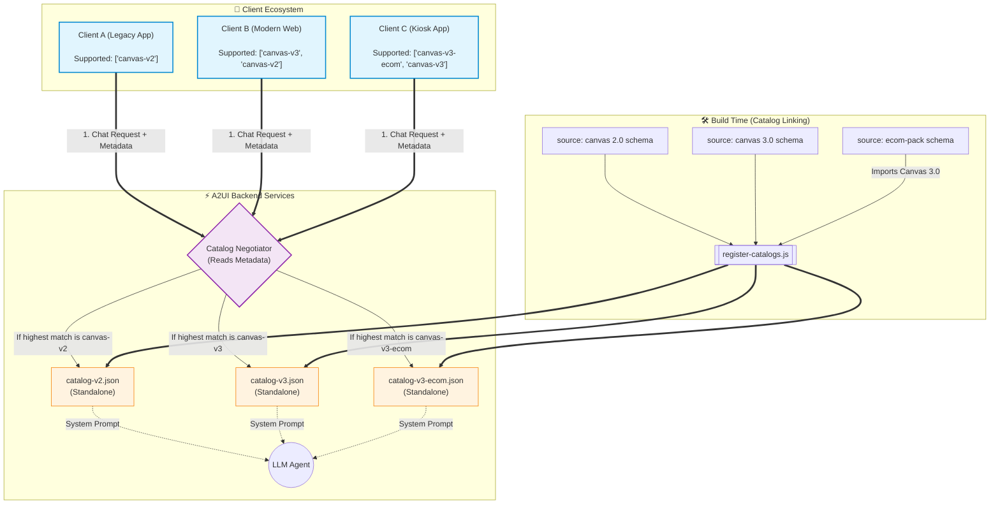

# A2UI Catalog Architecture: Multi-Version & Expansion Packs

This document explains how the A2UI framework elegantly handles complex real-world scenarios, such as migrating between major design system versions (Canvas 2.0 to 3.0) and supporting specialized "expansion packs" for specific product flows.

## 1. The Scenario

You have an ecosystem with:
1. **Canvas 2.0**: The legacy design system. Older mobile apps still use this.
2. **Canvas 3.0**: The modern core design system. The new web app uses this.
3. **Canvas 3.0 + Expansion Pack**: A specialized set of complex templates (e.g., a checkout flow) built on top of Canvas 3.0. Only a specific "E-commerce Kiosk" app uses this.

---

## 2. Architecture Diagram

The following Mermaid diagram illustrates how Catalog Composition (linking) and Catalog Negotiation interact to serve the correct UI to three different types of clients.

---

## 3. How the Rules Apply to this Scenario

### Catalog Composition (The Build Step)
How do we maintain these without copy-pasting code?
- **Canvas 2.0** and **Canvas 3.0** schemas are authored independently.
- **The Expansion Pack** schema does NOT redefine buttons or text. It simply uses the `imports` array to pull in Canvas 3.0, and then defines its new compositions (e.g., `<CheckoutTemplate>`).
- At build time, `register-catalogs.js` flattens these modular files into three standalone JSON files (`catalog-v2.json`, `catalog-v3.json`, `catalog-v3-ecom.json`).

### Catalog Negotiation (The Runtime Step)
How does the contract stay intact when a user sends a message?

> [!NOTE]
> Clients always send an ordered array from most preferred to least preferred.

1. **Client A (Legacy)** sends `["canvas-v2"]`. 
   - The Negotiator sees this. It instructs the LLM using `catalog-v2.json`. The LLM generates legacy JSON. The app doesn't crash.
2. **Client B (Modern)** sends `["canvas-v3", "canvas-v2"]`.
   - The app prefers 3.0 but has backward compatibility for 2.0. The Negotiator sees `canvas-v3` is supported by the backend, selects it, and uses `catalog-v3.json`. The LLM generates modern UI.
3. **Client C (Kiosk)** sends `["canvas-v3-ecom", "canvas-v3"]`.
   - The Negotiator selects `canvas-v3-ecom`. The LLM receives the massive composed catalog (Canvas 3.0 + Ecom Pack) in its system prompt and knows it has permission to generate the highly specialized `<CheckoutTemplate>` component.

### Graceful Degradation
What happens if the backend completely deprecates and deletes `canvas-v2.json`?
When Client A sends a message with `["canvas-v2"]`, the Negotiator checks its available catalogs and finds zero matches. Because of the strict A2UI contract, the Negotiator **refuses** to invoke the UI-generating agent. Instead, it falls back to a plain-text response (or returns an error code), preventing the legacy app from receiving unrenderable Canvas 3.0 JSON and crashing.
