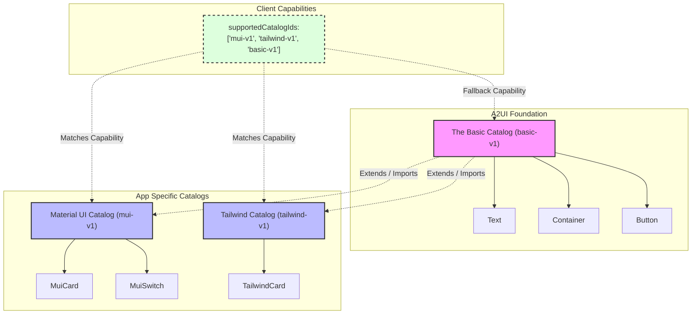
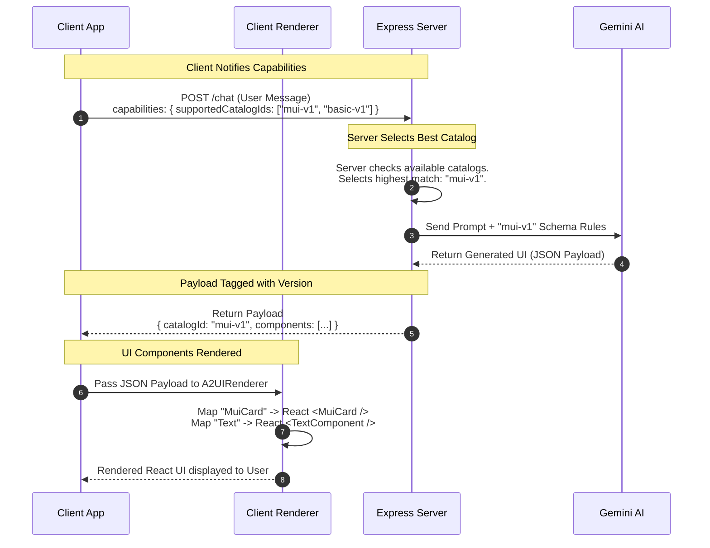

# A2UI Catalog Flow & Architecture

This document explains how Catalogs power the Generative UI in our application, making it easy for the AI to understand what it can build, and for the client to know how to render it.

## 1. Catalog Definition & Composition

Catalogs act as a strict dictionary. They tell the AI exactly what UI components exist and what properties they accept. 

> [!NOTE]
> **The Basic Catalog** provides standard components (Text, Container, Button).
> **Defining Your Own Catalog** allows you to create app-specific components.
> **Extending the Basic Catalog** (Composition) means your custom catalog can inherit the standard components so you don't have to reinvent the wheel.

## 2. Catalog Linking, Naming & Versioning

> [!IMPORTANT]
> **Catalog Naming & Versioning**: Catalogs should be strictly versioned (e.g., `basic-v1`, `mui-v1`). If you make breaking changes to your components, you bump the version (`mui-v2`) so older clients don't crash.
> **Catalog Linking**: The AI's JSON output always includes a `catalogId`. This links the generated UI schema back to the specific version of the catalog used to generate it.

## 3. The Runtime Flow: Negotiation to Rendering

This sequence diagram shows what happens when a user sends a message, covering how the client and server agree on a catalog and how the UI is ultimately rendered.

### Breakdown of the Runtime Steps:
1. **Client notifies capabilities:** The client tells the server what it knows how to render. (e.g., "I know how to render `mui-v1` and `basic-v1`").
2. **Server selects best catalog:** The server looks at what the client supports, and what catalogs the server has loaded. It picks the best match.
3. The server builds a prompt for Gemini that *only* includes the components from the negotiated catalog.
4. Gemini responds with a JSON payload that strictly adheres to the catalog.
5. The payload is linked to the catalog version (e.g. `catalogId: "mui-v1"`).
6. **UI Components Rendered:** The client receives the JSON, and uses its Renderer (`COMPONENT_MAP`) to translate the JSON component names into actual React Components.
