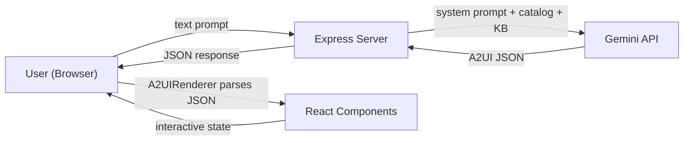

# A2UI TelcoConnect — Implementation Plan

A next-generation chat experience for a major US telecom company, built on the **A2UI (Agent-to-User Interface) protocol**: the AI generates declarative JSON, and the client natively renders it into rich, interactive UI components.

## Architecture Overview

**Core A2UI Philosophy:**
1. The **AI** decides _what_ UI to show (declarative JSON).
2. The **client** decides _how_ to render it (native React components).
3. A **catalog** acts as the security boundary — only allowlisted components are rendered.

---

## Proposed Changes

### Phase 1 — Project Scaffolding

#### [NEW] `d:\A2UI\README.md`
- Project overview, install instructions, and run commands.

#### [NEW] `d:\A2UI\server\package.json`
- Express backend dependencies: `express`, `cors`, `dotenv`, `@google/generative-ai`.

#### [NEW] `d:\A2UI\client\` (Vite + React)
- Scaffolded with `npm create vite@latest` using React template.
- Dependencies: `react`, `react-dom`, standard Vite tooling.

---

### Phase 2 — The Trusted Catalog (Security Boundary)

#### [NEW] `d:\A2UI\server\catalog.json`
A strict allowlist schema defining exactly which UI components the AI may generate. Each component specifies:
- `id` — unique component identifier (e.g., `Container`, `Typography`, `Button`, `SelectionCard`, `Badge`, `Toggle`, `Divider`, `PlanComparisonGrid`, `PerkCard`).
- `description` — what the component renders (for the LLM's understanding).
- `allowedProps` — exhaustive list of valid props and their types.
- `allowedChildren` — which other catalog components may be nested inside.

> [!IMPORTANT]
> This file is the **XSS prevention layer**. The renderer will reject any component ID not present in the catalog, and will strip any prop not in `allowedProps`. No raw HTML, no `dangerouslySetInnerHTML`, no script injection vectors.

**Component Set (9 components):**

| Component | Purpose |
|---|---|
| `Container` | Layout wrapper with flex/grid, padding, gap, background |
| `Typography` | Text rendering (headings, body, captions) with variant/color/align |
| `Button` | Interactive button with variant (primary/secondary/outline), action binding |
| `SelectionCard` | Clickable plan/perk card with selected state, price, features list |
| `Badge` | Small label chip (e.g., "Popular", "New", "$10/mo") |
| `Toggle` | On/off switch for add-ons/perks with label and binding key |
| `Divider` | Visual separator |
| `PlanComparisonGrid` | Special grid layout for side-by-side plan comparison |
| `PerkCard` | Entertainment/add-on card with icon, description, toggle |

---

### Phase 3 — The Agent Backend

#### [NEW] `d:\A2UI\server\index.js`
Express server with:
- **CORS** enabled for the React dev server.
- Reads `catalog.json` at startup, injects into Gemini system prompt.
- `POST /chat` endpoint: receives `{ message: string }`, sends to Gemini, returns A2UI JSON.

#### [NEW] `d:\A2UI\server\knowledgeBase.js`
Hardcoded telecom knowledge base:
- **3 Plans**: Starter ($35/mo), Unlimited Plus ($55/mo), Unlimited Premium ($75/mo).
- **3 Streaming Perks**: StreamMax HD ($10/mo), MusicFlow Premium ($8/mo), GameZone Pro ($12/mo).
- **Features matrix**: data caps, hotspot, international, 5G tiers.

#### [NEW] `d:\A2UI\server\systemPrompt.js`
Constructs the full system prompt for Gemini:
1. Role definition ("You are TelcoConnect's AI assistant").
2. A2UI protocol rules (respond ONLY with valid JSON, use ONLY catalog components).
3. The full catalog schema.
4. The knowledge base data.
5. JSON output format specification with examples.

#### [NEW] `d:\A2UI\server\.env.example`
Template for `GEMINI_API_KEY=your_key_here`.

---

### Phase 4 — The Custom React Renderer (Frontend)

#### [NEW] `d:\A2UI\client\src\components\A2UIRenderer.jsx`
**The heart of the application.** A recursive rendering engine that:
1. Receives an A2UI JSON tree.
2. Validates each node's `component` against the catalog allowlist.
3. Maps component IDs to native React components via a `COMPONENT_MAP`.
4. Passes only allowlisted props.
5. Recursively renders `children` arrays.
6. Handles **data binding**: components like `Toggle` and `SelectionCard` read/write to a centralized state object via JSON pointer-style keys (e.g., `bindings.toggles.streammax`).

#### [NEW] `d:\A2UI\client\src\components\ui\` (7-9 component files)
Each catalog component implemented as a React component:
- `ContainerComponent.jsx` — flex/grid wrapper with theming.
- `TypographyComponent.jsx` — renders h1-h6, p, span with variants.
- `ButtonComponent.jsx` — styled button with click handler bound to state actions.
- `SelectionCardComponent.jsx` — interactive card with selected/unselected styling, click to select.
- `BadgeComponent.jsx` — small colored chip.
- `ToggleComponent.jsx` — animated toggle switch, bound to state key.
- `DividerComponent.jsx` — horizontal rule.
- `PerkCardComponent.jsx` — entertainment add-on card with embedded toggle.
- `PlanComparisonGridComponent.jsx` — CSS grid for plan comparison layout.

#### [NEW] `d:\A2UI\client\src\context\A2UIStateContext.jsx`
Centralized React context + reducer for tracking all user interactions:
- `selectedPlan` — which plan the user clicked.
- `toggles` — object of `{ [perkId]: boolean }` for add-on switches.
- `cart` — accumulated selections for checkout flow.
- Actions dispatched by bound components (e.g., `SELECT_PLAN`, `TOGGLE_PERK`).

#### [NEW] `d:\A2UI\client\src\App.jsx`
Main chat interface:
- Message input bar at bottom.
- Scrollable message history (user messages + AI-rendered A2UI blocks).
- Loading state while waiting for Gemini response.
- Premium dark theme with glassmorphism chat bubbles.

#### [NEW] `d:\A2UI\client\src\index.css`
Global design system:
- CSS custom properties for colors, spacing, typography.
- Dark mode palette (deep navy/slate with accent gradients).
- Component-level styles (cards, toggles, badges, buttons).
- Smooth micro-animations and transitions.
- Google Font: Inter.

---

### Phase 5 — Polish & UX

- Typing indicator animation while AI responds.
- Smooth scroll-to-bottom on new messages.
- Error state rendering (graceful fallback if JSON is malformed).
- Welcome message with suggested prompts the user can click.
- Responsive layout (works on mobile viewports).

---

## Open Questions

> [!IMPORTANT]
> **Gemini Model**: I plan to use `gemini-2.0-flash` for speed and cost efficiency. Would you prefer a different model (e.g., `gemini-2.5-pro` for higher quality)?

> [!NOTE]
> **Port Configuration**: Backend will run on `:3001`, frontend on `:5173` (Vite default). Let me know if you need different ports.

---

## Verification Plan

### Automated Tests
- `node server/index.js` starts without errors.
- `npm run dev` in client starts without errors.

### Manual Verification
1. Start the backend server, then the React dev server.
2. Open the chat UI in browser.
3. Send test prompts:
   - "Show me your available plans" → should render SelectionCards.
   - "Compare Unlimited Plus vs Premium" → should render PlanComparisonGrid.
   - "What streaming perks can I add?" → should render PerkCards with Toggles.
   - "I want the Premium plan with StreamMax" → should render a confirmation/checkout view.
4. Verify interactivity: clicking a SelectionCard updates state, toggles animate and track state, buttons trigger actions.
5. Verify security: manually inject a non-catalog component in JSON — renderer should skip it with a warning.
